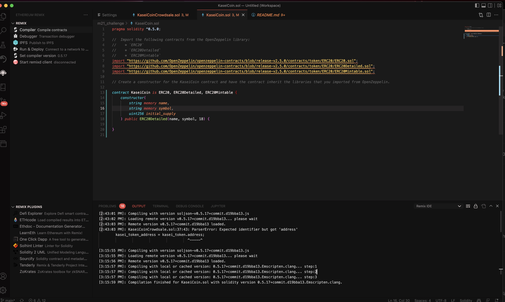
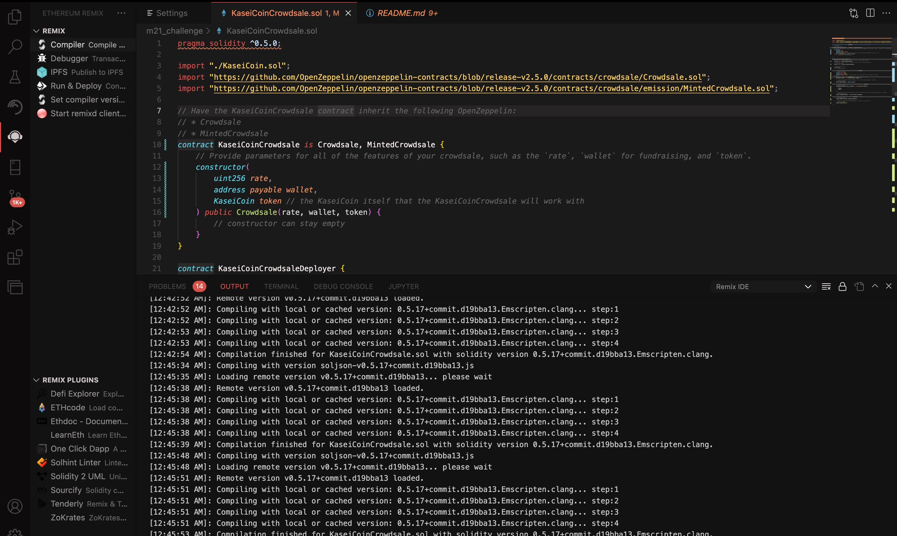
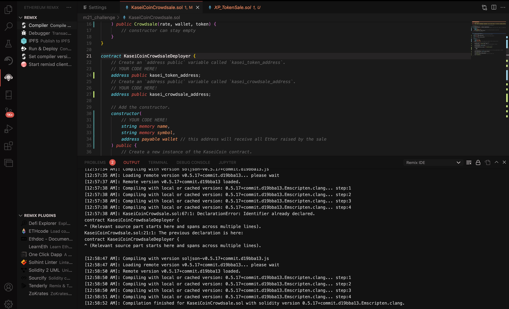
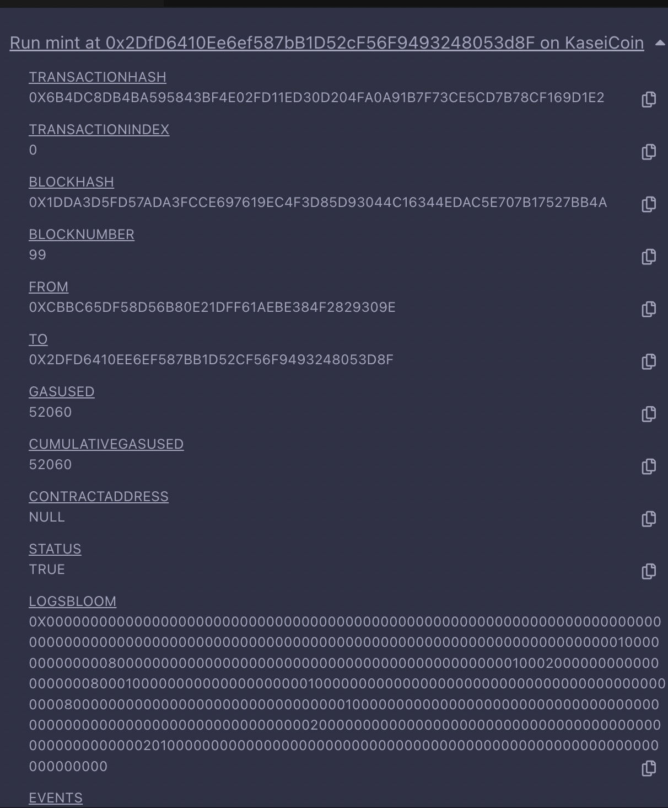

# Module 21 Challange

## Solidarity Crowdsales with Ganache

### Pete Petersen

### 06/26/2022  


## Overview

After waiting for years and passing several tests, you were selected by the Martian Aerospace Agency to be part of the first human colony on Mars. As a prominent fintech professional, you were chosen to lead a project to develop a monetary system for the new Mars colony. You have decided to base this new monetary system on blockchain technology, and to define a new cryptocurrency called KaseiCoin. (“Kasei” means “Mars” in Japanese.)

KaseiCoin will be a fungible token that is ERC-20 compliant. You will launch a crowdsale that will allow people who are moving to Mars to convert their earthling money to KaseiCoin.

## Screenshot of KaseiCoin Successfully Compiled



## Screenshot of KaseiCoinCrowdSale Successfully Compiled



## Screenshot of KaseiCoinCrowdSaleDeployer Successfully Compiled



## Screenshot of Minted Block

  

## Movie of Navigating Deployed Application

  

  

## KaseiCoin.sol

**KaseiCoin.sol** is the coin\token being created. It inherits the ERC20, ERC20Detailed, and ERC20Mintable from the open zepplin project.  This contract is used by deployer and KasieCoinrowdsale  and KasieCoinrowdsaleDeployer when creating and traansacting coin.

```python

pragma solidity ^0.5.0;

//  Import the following contracts from the OpenZeppelin library:
//    * `ERC20`
//    * `ERC20Detailed`
//    * `ERC20Mintable`
import "https://github.com/OpenZeppelin/openzeppelin-contracts/blob/release-v2.5.0/contracts/token/ERC20/ERC20.sol";
import "https://github.com/OpenZeppelin/openzeppelin-contracts/blob/release-v2.5.0/contracts/token/ERC20/ERC20Detailed.sol";
import "https://github.com/OpenZeppelin/openzeppelin-contracts/blob/release-v2.5.0/contracts/token/ERC20/ERC20Mintable.sol";

// Create a constructor for the KaseiCoin contract and have the contract inherit the libraries that you imported from OpenZeppelin.

contract KaseiCoin is ERC20, ERC20Detailed, ERC20Mintable {
    constructor(
        string memory name,
        string memory symbol,
        uint256 initial_supply
    ) public ERC20Detailed(name, symbol, 18) {
        mint(msg.sender, initial_supply);
    }
}

```

## KaseiCoinCrowdSale

**KaseiCoinCrowdSale** contains two contracts.  The first, **KaseiCoinCrowdsale** inherits from Crowdsale and MintedCrowdsale from the openzepplin project and is primarily is for managing the wallets and fucntion required for the initial sale.  The second contract, **KaseiCoinCrowdsaleDeployer** is the actual functional contract that manages the flow of transactions.

```python

pragma solidity ^0.5.0;

import "./KaseiCoin.sol";
import "https://github.com/OpenZeppelin/openzeppelin-contracts/blob/release-v2.5.0/contracts/crowdsale/Crowdsale.sol";
import "https://github.com/OpenZeppelin/openzeppelin-contracts/blob/release-v2.5.0/contracts/crowdsale/emission/MintedCrowdsale.sol";

// Have the KaseiCoinCrowdsale contract inherit the following OpenZeppelin:
// * Crowdsale
// * MintedCrowdsale
contract KaseiCoinCrowdsale is Crowdsale, MintedCrowdsale {
    // Provide parameters for all of the features of your crowdsale, such as the `rate`, `wallet` for fundraising, and `token`.
    constructor(
        uint256 rate,
        address payable,
        KaseiCoin token // the KaseiCoin itself that the KaseiCoinCrowdsale will work with
    ) public Crowdsale(rate, wallet, token) {
        // constructor can stay empty
    }
}

contract KaseiCoinCrowdsaleDeployer {
    // Create an `address public` variable called `kasei_token_address`.
    // YOUR CODE HERE!
    address public kasei_token_address;
    // Create an `address public` variable called `kasei_crowdsale_address`.
    // YOUR CODE HERE!
    address public kasei_crowdsale_address;

    // Add the constructor.
    constructor(
        // YOUR CODE HERE!
        string memory name,
        string memory symbol,
        address payable wallet // this address will receive all Ether raised by the sale
    ) public {
        // Create a new instance of the KaseiCoin contract.
        // YOUR CODE HERE!
        KaseiCoin token = new KaseiCoin(name, symbol, 18);
        // Assign the token contract’s address to the `kasei_token_address` variable.
        // YOUR CODE HERE!
        kasei_token_address = address(token);
        // Create a new instance of the `KaseiCoinCrowdsale` contract
        // YOUR CODE HERE!
        KaseiCoinCrowdsale kasei_crowdsale = new KaseiCoinCrowdsale(
            1,
            wallet,
            token
        );
        // Aassign the `KaseiCoinCrowdsale` contract’s address to the `kasei_crowdsale_address` variable.
        // YOUR CODE HERE!
        kasei_crowdsale_address = address(kasei_crowdsale);
        // Set the `KaseiCoinCrowdsale` contract as a minter
        // YOUR CODE HERE!
        token.addMinter(kasei_crowdsale_address);
        // Have the `KaseiCoinCrowdsaleDeployer` renounce its minter role.
        // YOUR CODE HERE!
        token.renounceMinter();
    }
}
```

## Other Notes

The application was tested using Ganache Version 2.5.4 (2.5.4.1367)
